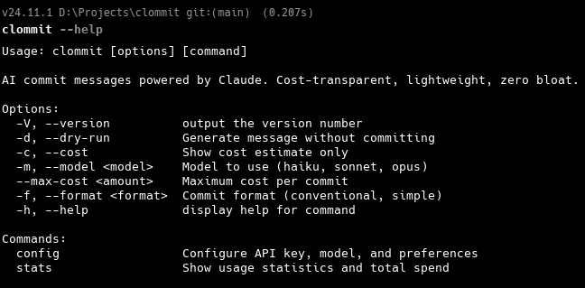

# clommit

**AI commit messages powered by Claude. Cost-transparent. Zero bloat.**

> cl(aude) + (c)ommit = **clommit**

```bash
npx clommit
```



---

## Why clommit?

Every AI commit tool generates the same lazy one-liner: `fix: update files`. Then charges you for it without telling you how much.

clommit does two things differently:

**1. The commits are actually good.** Subject line + structured body. Every word earns its place. A senior engineer reading only the commit message should understand the change well enough to review it. Follows the [50/72 rule](https://deviq.com/practices/50-72-rule/) and [Conventional Commits](https://www.conventionalcommits.org/).

**2. You always know the cost.** Before every API call, you see the estimated token count and price. After, you see the actual cost. Set a budget ceiling with `--max-cost`. Track your total spend with `clommit stats`. No surprises.

---

## Before & After

Without clommit:

```
fix: update user stuff
```

```
wip
```

```
changes
```

With clommit:

```
fix(auth): prevent token refresh race condition on concurrent requests

- Add mutex lock around refresh token exchange to prevent multiple
  simultaneous refresh attempts from invalidating each other
- Return pending refresh promise to concurrent callers instead of
  triggering duplicate API calls
- Add regression test covering parallel request scenario
```

---

## How It Works

```
  ┌──────────────┐
  │  git diff     │  Staged changes only
  │  --cached     │
  └──────┬───────┘
         │
         ▼
  ┌──────────────┐
  │  Smart Diff   │  < 2k tokens → full diff
  │  Truncation   │  2k-8k → stat + truncated hunks
  │               │  > 8k → stat + filenames + head
  └──────┬───────┘
         │
         ▼
  ┌──────────────┐
  │  Cost         │  Estimate tokens (chars ÷ 4)
  │  Estimation   │  Calculate price from model rates
  │               │  Show to user, ask to proceed
  └──────┬───────┘
         │
         ▼
  ┌──────────────┐
  │  Claude API   │  Direct HTTP fetch
  │  (no SDK)     │  Haiku / Sonnet / Opus
  └──────┬───────┘
         │
         ▼
  ┌──────────────┐
  │  Display      │  Subject (bold green)
  │  & Confirm    │  Body (white, indented)
  │               │  Actual cost from API response
  └──────┬───────┘
         │
         ▼
  ┌──────────────┐
  │  git commit   │  Multi-paragraph via -m flags
  │  -m -m        │  Proper subject/body separation
  └──────────────┘
```

---

## Quick Start

### Install

```bash
# Use directly (no install)
npx clommit

# Or install globally
npm install -g clommit
```

### Setup

```bash
clommit config
```

You'll be prompted for your [Anthropic API key](https://console.anthropic.com/settings/keys), preferred model, and commit format.

### Use

```bash
# Stage your changes
git add .

# Generate and commit
clommit

# Preview without committing
clommit -d

# Check cost before calling the API
clommit -c

# Use a specific model
clommit -m sonnet

# Set a budget ceiling
clommit --max-cost 0.01
```

---

## Commands & Flags

| Command / Flag | Description |
|---|---|
| `clommit` | Generate commit message and commit |
| `clommit config` | Set API key, model, format, budget |
| `clommit stats` | View total spend and usage breakdown |
| `-d, --dry-run` | Generate message, don't commit |
| `-c, --cost` | Show cost estimate only, no API call |
| `-m, --model <name>` | Use `haiku`, `sonnet`, or `opus` |
| `-f, --format <type>` | `conventional` (default) or `simple` |
| `--max-cost <amount>` | Refuse if estimated cost exceeds limit |

---

## Cost Transparency

clommit shows cost at every step:

| When | What you see |
|---|---|
| Before API call | Estimated tokens and cost |
| After API call | Actual tokens and cost from API response |
| `clommit stats` | Lifetime totals, per-model breakdown |
| `--max-cost` | Hard ceiling — blocks expensive calls |

### Pricing per commit (typical)

| Model | ~Input | ~Output | ~Cost per commit |
|---|---|---|---|
| Haiku | 1,000 tokens | 80 tokens | **$0.0004** |
| Sonnet | 1,000 tokens | 80 tokens | **$0.0042** |
| Opus | 1,000 tokens | 80 tokens | **$0.0210** |

Haiku is the default. At $0.0004 per commit, that's roughly **2,500 commits per dollar**.

---

## Comparison

| Feature | clommit | Cursor / VS Code | opencommit | aicommits | claude-commit |
|---|---|---|---|---|---|
| Editor-independent | ✅ Any terminal | ❌ Editor only | ✅ | ✅ | ⚠️ Needs CLI |
| Claude-native | ✅ Direct API | ❌ No model choice | ❌ OpenAI-first | ❌ OpenAI only | ⚠️ Needs Claude Code |
| Cost shown before call | ✅ | ❌ | ❌ | ❌ | ❌ |
| Actual cost shown after | ✅ | ❌ | ❌ | ❌ | ❌ |
| Budget ceiling | ✅ `--max-cost` | ❌ | ❌ | ❌ | ❌ |
| Spend tracking | ✅ `clommit stats` | ❌ | ❌ | ❌ | ❌ |
| Multi-line body | ✅ Subject + body | ❌ One-liner | ❌ One-liner | ❌ One-liner | ❌ One-liner |
| Smart diff truncation | ✅ 3-tier | ❌ | ❌ | ❌ | ❌ |
| Model selection | ✅ Haiku/Sonnet/Opus | ❌ | ⚠️ OpenAI models | ⚠️ OpenAI models | ❌ |
| Works with `npx` | ✅ | ❌ | ✅ | ✅ | ❌ |

---

## Architecture

```
clommit/
├── src/
│   ├── index.ts              # CLI entry (commander)
│   ├── commands/
│   │   ├── commit.ts         # Main flow: diff → estimate → call → confirm → commit
│   │   ├── config.ts         # Interactive setup wizard
│   │   └── stats.ts          # Usage statistics display
│   ├── lib/
│   │   ├── claude.ts         # Claude API client (direct HTTP)
│   │   ├── cost.ts           # Pricing table, token estimation, formatting
│   │   ├── git.ts            # Git operations, smart diff, multi-paragraph commit
│   │   └── prompt.ts         # Prompt engineering for high-quality output
│   ├── config/
│   │   └── store.ts          # ~/.clommit/ config and stats persistence
│   └── types/
│       └── index.ts          # Shared TypeScript interfaces
├── package.json
├── tsconfig.json
└── tsup.config.ts
```

### Design Decisions

| Decision | Choice | Reasoning |
|---|---|---|
| Claude API integration | Direct `fetch` | Zero dependencies. No SDK version lock-in. The messages endpoint is one POST request — a wrapper adds nothing. |
| Token estimation | `chars ÷ 4` | Accurate enough for cost estimates without importing a tokenizer library. Actual cost is shown after from API response anyway. |
| Diff strategy | 3-tier truncation | Small diffs get full context. Large diffs get smart summaries. Prevents blowing up token costs on monorepo commits. |
| Commit format | Multi `-m` flags | Git natively separates paragraphs from multiple `-m` flags. `git log --oneline` shows the subject, `git log` shows everything. No temp files. |
| Config storage | `~/.clommit/` JSON | Portable, human-readable, no database. Easy to version-control or share. |
| Default model | Haiku | Best cost-to-quality ratio for commit messages. ~$0.0004 per commit means developers actually use it daily without worrying. |
| Build tool | tsup | Zero-config, fast, produces clean ESM output with shebang banner for CLI usage. |
| Dependencies | 2 (chalk + commander) | Minimal surface area. Both are battle-tested, stable, and do exactly one thing well. |

---

## Built With

| | |
|---|---|
| **Runtime** | Node.js 18+ |
| **Language** | TypeScript (strict mode) |
| **AI** | Claude API — Haiku, Sonnet, Opus |
| **CLI** | commander |
| **Styling** | chalk |
| **Bundler** | tsup |
| **Dependencies** | 2 production, 3 dev. That's it. |

---

## Contributing

Contributions are welcome. If you're opening a PR, please:

1. Keep the dependency count low. If you can do it without a package, do it without a package.
2. Use clommit to write your commit messages. Dogfooding is the best QA.
3. Follow the existing code style — strict TypeScript, no `any` leaks, modular files.

```bash
# Clone and set up
git clone https://github.com/muhammadcaeed/clommit.git
cd clommit
npm install
npm run build

# Link for local testing
npm link
clommit config
```

---

## Roadmap

- [ ] `clommit --amend` — regenerate message for the last commit
- [ ] Config option to skip confirmation (`autoCommit: true`)
- [ ] Custom prompt templates via `.clommit` project file
- [ ] Git hook integration (`prepare-commit-msg`)
- [ ] Session cost tracking (total for current terminal session)
- [ ] Retry with exponential backoff for transient API failures

---

## FAQ

**How is this different from Cursor / VS Code's built-in commit button?**
Those are editor-locked, generate single-line messages, give you no model choice, no cost visibility, and no prompt control. clommit works in any terminal, produces subject + body, lets you pick the model, and shows you exactly what you're spending. Switch editors, SSH into a server, run in CI — clommit still works.

**How is this different from Claude Code's built-in git workflow?**
Claude Code is a full agentic coding environment that requires a Pro/Max subscription ($20–$200/mo). clommit is a single-purpose tool: API key, pay-per-use ($0.0004/commit with Haiku), works in any terminal, any editor, any workflow. You don't need the whole kitchen just to write a commit message.

**Why not just use opencommit or aicommits?**
They're OpenAI-first, generate single-line messages, and never show you what you're spending. clommit is Claude-native, generates subject + body, and puts cost transparency at the center.

**Is Haiku good enough for commit messages?**
Yes. Commit messages are a short-output task — Haiku handles them extremely well at a fraction of the cost. Use Sonnet or Opus for large, complex diffs where you want deeper analysis.

**What happens with huge diffs?**
clommit automatically truncates in three tiers: full diff under 2k tokens, stat + truncated hunks under 8k, stat + filenames + head above 8k. You're always warned when truncation happens.

**Can I use this in CI/CD?**
Yes. Set `autoCommit: true` in config and pipe it — no interactive prompts needed.

---

## License

MIT

---

<p align="center">
  <i>Built with Claude. Commits powered by Claude. Obviously.</i>
</p>